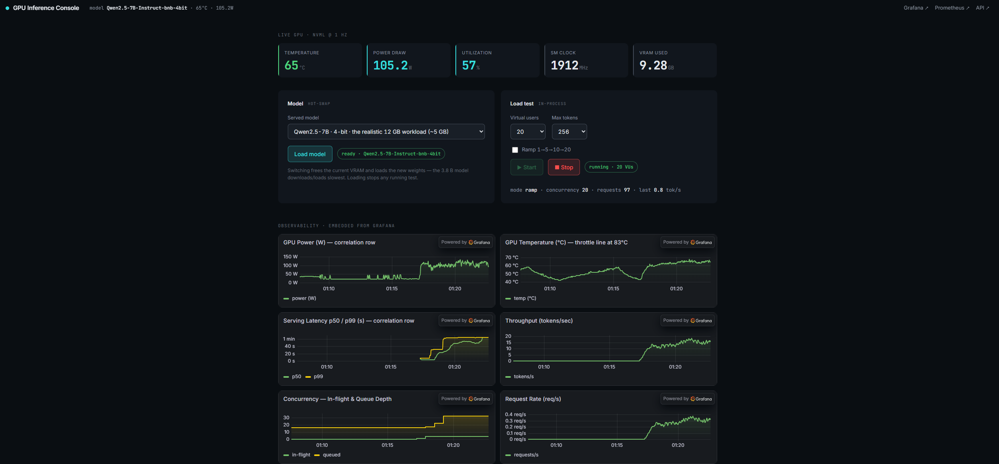
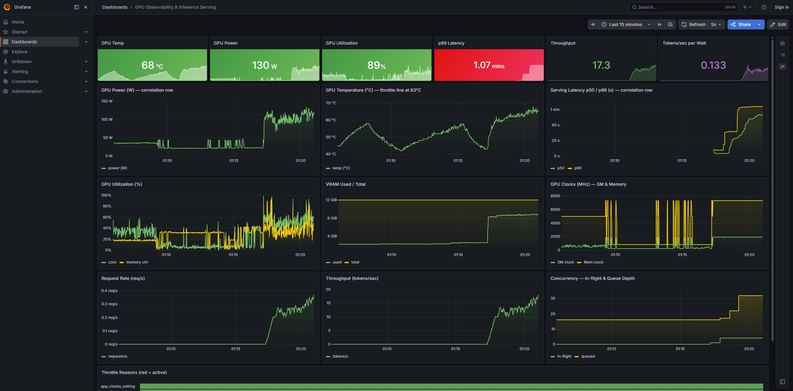

# GPU LLM Telemetry and Benchmark

This project runs a large language model on an NVIDIA GPU and benchmarks how it behaves under
load. It serves the model over an API, drives traffic at it with a load generator, and tracks the
GPU and the serving layer live: throughput, tail latency, power draw, temperature, clocks, VRAM,
and throttle reasons. It was built and measured on a Windows 11 machine with an RTX 3060 (12 GB).

The headline result: under inference this GPU is limited by memory bandwidth, not heat, so it
saturates on throughput and tail latency long before it ever thermally throttles.



## How it works

A Python exporter reads the GPU through NVML (nvidia-ml-py) every 250 ms and publishes the numbers
with prometheus-client. A FastAPI server runs the model on the GPU with PyTorch and HuggingFace
Transformers, exposes a `/generate` endpoint, and reports its own serving metrics: request rate, a
latency histogram for p50 and p99, tokens per second, and queue depth.

Prometheus scrapes both the exporter and the server, and Grafana renders the dashboards. Both run
in Docker. k6 generates the load for the benchmark, and a small web console served by the API lets
you switch models and start or stop a load test from the browser.

You can pick from six models, from Qwen2.5-0.5B up to a 4-bit Qwen2.5-7B (the realistic workload
for a 12 GB card), with the 4-bit model loaded through bitsandbytes. The application runs natively
on Windows so it has full access to the GPU and NVML, while Prometheus and Grafana run in Docker
and scrape the host.

## Results

Measured on the RTX 3060. All numbers are from real runs.



- Throughput leveled off around 41 tokens per second on the small model. Past the GPU concurrency
  limit, extra users added latency, not throughput.
- As load went from 1 to 20 users, p99 latency (the slowest 1 percent of requests) rose from about
  2 seconds to about 31 seconds, roughly 15 times, and the request queue grew from 0 to 18.
- Across every model size and load level, the GPU stayed between 65 and 68 C at 120 to 143 W and
  never thermally throttled. LLM decoding waits on memory bandwidth, so the chip is not pinned and
  the power and heat level off well below the throttle point.
- The realistic 4-bit Qwen2.5-7B used about 7.6 GB of VRAM and ran about 17.7 tokens per second on
  a single request. Power efficiency was about 0.78 tokens per second per watt.
- Idle baseline was about 22 to 29 W at 47 to 53 C.

## Prerequisites

- Windows 11 with an NVIDIA GPU. Built and run on an RTX 3060 (12 GB).
- The NVIDIA GPU driver.
- Python 3.11 or newer.
- Git.
- Docker. On this machine Docker runs inside WSL2.
- k6 for the load test (`winget install GrafanaLabs.k6`).

## Quick start (Windows PowerShell)

```powershell
# 1. Clone the repo and enter it
git clone https://github.com/ericleee/gpu-llm-telemetry-benchmark.git
cd gpu-llm-telemetry-benchmark

# 2. Create and activate a virtual environment (needs Python 3.11 or newer)
python -m venv .venv
.\.venv\Scripts\Activate.ps1
python -m pip install --upgrade pip

# 3. Install the CUDA build of PyTorch first, then everything else
pip install torch --index-url https://download.pytorch.org/whl/cu128
pip install -r requirements.txt

# 4. Confirm PyTorch sees the GPU (prints True when CUDA is working)
python -c "import torch; print(torch.cuda.is_available())"

# 5. Run each service in its own terminal (the first three keep running)
python exporter\gpu_exporter.py      # GPU telemetry exporter, port 9100
python server\app.py                 # inference server and web console, port 8000
.\scripts\start-monitoring.ps1       # Prometheus (9090) and Grafana (3001) in Docker
k6 run loadtest\generate_load.js     # run the load test

# 6. Open the console at http://127.0.0.1:8000 and Grafana at http://localhost:3001
```

## License

Personal portfolio project. Eric Lee.
